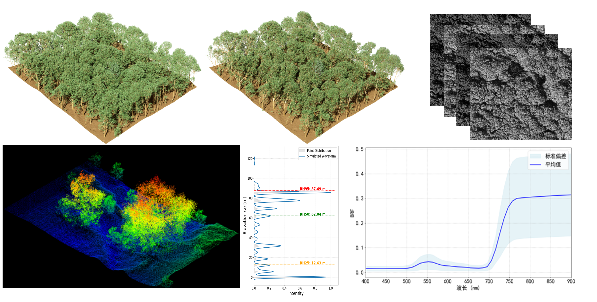

# RAPID-RTX

RAPID-RTX is a high-performance 3D radiative transfer model (RTM) simulation platform built on NVIDIA Isaac Sim. It leverages RTX and OpenUSD technologies to support multiple 3D formats, including USD, OBJ, FBX, and PLY. Developed in Python and C++, RAPID-RTX enables the simulation of diverse remote sensing datasets and the generation of high-fidelity images within large, complex 3D environments. The platform features GPU-accelerated ray tracing, physics‑based force field simulation (planned for v1.1.0), and multi‑sensor simulation including optical and LiDAR (point cloud/full waveform), with SAR support planned for v1.1.0. In addition, RAPID-RTX supports multi‑angle and multispectral observations, providing an end‑to‑end solution for remote sensing simulation.

## Prerequisites and Environment Setup

Ensure your system is set up with the following before building Isaac Sim:

- Operating System: Windows 10/11.

- GPU: For additional information on GPU features and requirements, see [NVIDIA GPU Requirements](https://docs.omniverse.nvidia.com/dev-guide/latest/common/technical-requirements.html).

  | Min     | Recommended  | Best                               |
  | ------- | ------------ | ---------------------------------- |
  | RTX3070 | RTX 5080     | RTX PRO 6000 Blackwell Workstation |
  |         | RTX 5880 Ada | RTX PRO 5000 Blackwell Workstation |

### Required Software

- Isaac Sim(5.1):The main kernel of the RAPID-RTX, [Quick Install — Isaac Sim Documentation](https://docs.isaacsim.omniverse.nvidia.com/5.1.0/installation/quick-install.html).

## Quick Start

### 1. Download RAPID-RTX Zip

Click the "Code" button and select "Download ZIP", then extract the file.

### 2. Build

Unzip the Isaac Sim archive, then copy all files from RAPID-RTX to the Isaac Sim root directory.

### 3. Run

Double-click RAPID-RTX.exe to run the program.

- **⚠️ Startup Time** The first time loading Isaac Sim may take up to several minutes as Extensions and Shader are loaded and cached. The subsequent startup time should be in the ranges of 10-30 seconds depending on hardware configuration.
- **⚠️Installation Path Length Limit**: Windows limits path length to 260 characters. If you encounter missing files or other build errors, try moving the repository to a shorter path. It is recommended to use decompression software such as Bandizip instead of the Windows system decompression.
- **⚠️License Terms**: If this is your first time building/loading RAPID-RTX, you will be prompted to accept the Omniverse license terms.

## Support

- Please use GitHub [Discussions](https://github.com/isaac-sim/IsaacSim/discussions) for discussing ideas, asking questions, and requests for new features.
- For any questions, suggestions, or to seek cooperation, please contact me via the following email address: zzz_zhang666@163.com;huaguo_huang@bjfu.edu.cn
- Video tutorials (Chinese):https://space.bilibili.com/345754400?spm_id_from=333.1007.0.0
- User Manual: After opening the program, please select User Manual from the support menu in the upper left corner.

## Citation

- When using RAPID-RTX in your work, please cite:Z. Zhang, Y. Li, C. Liu and H. Huang, "RAPID-RTX: A Novel Real-Time Radiative Transfer and Force Field Modeling Framework for Forest BRF Simulations," in *IEEE Transactions on Geoscience and Remote Sensing*, vol. 63, pp. 1-14, 2025, Art no. 4423214, doi: 10.1109/TGRS.2025.3633556.
- To cite RAPID-RTX, click on "Cite this repository" in the right sidebar of the [RAPID-RTX GitHub repository](https://github.com/zzzBigWatermelon/RAPID-RTX) landing page and select one of the listed citation entries.

## License

RAPID-RTX is licensed under the Apache License, Version 2.0.  See the [LICENSE](LICENSE) file for details.

**Note**: RAPID-RTX depends on NVIDIA Isaac Sim, also distributed under the Apache 2.0 License.  