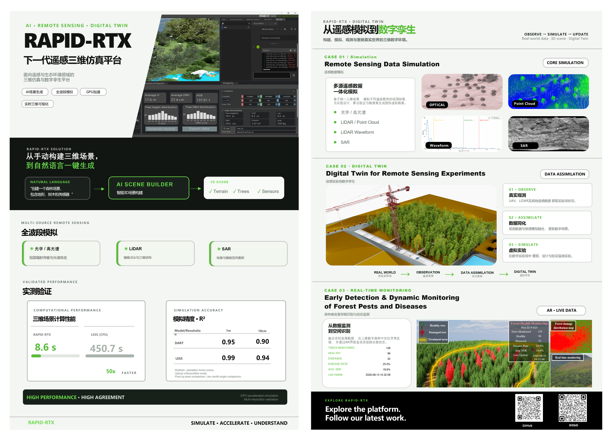

# RAPID-RTX

RAPID-RTX is a high-performance 3D Radiative Transfer Model (RTM) simulation platform based on NVIDIA Isaac Sim. Developed in Python, it supports the rapid generation of high-fidelity remote sensing imagery and point cloud data in large and complex 3D environments. The platform integrates a GPU-accelerated ray tracing engine, possessing multi-sensor, multi-angle, and multispectral simulation capabilities, covering mainstream remote sensing payloads such as optical and lidar (point cloud/full waveform). It also includes a built-in AI-driven scene generation module, significantly improving simulation efficiency and scene diversity.

Future version plans: v1.1.0 will introduce physics-based force field simulation and SAR simulation support, and plans to upgrade the underlying system to the latest Isaac Sim version to further improve simulation accuracy and platform compatibility.

## Key Features

- **AI-Driven Scene Generation**：Leverage natural language to build complex forest scenes with automated tool orchestration and customizable parameters.
- **Multi-Sensor Simulation**：Support optical sensors and LiDAR (point cloud / full-waveform) with multi-angle and multi-spectral capabilities.
- **RTX-Accelerated Ray Tracing**：High-performance GPU-accelerated rendering for high-fidelity image and point cloud generation in large-scale environments.
- **Physics-Based Simulation**：The plan supports physics-based force field simulation.

## Prerequisites and Environment Setup

Ensure your system is set up with the following before building Isaac Sim:

- Operating System: Windows 10/11.

- GPU: For additional information on GPU features and requirements, see [NVIDIA GPU Requirements](https://docs.omniverse.nvidia.com/dev-guide/latest/common/technical-requirements.html).

  | Min     | Recommended  | Best                               |
  | ------- | ------------ | ---------------------------------- |
  | RTX3070 | RTX 5080     | RTX PRO 6000 Blackwell Workstation |
  |         | RTX 5880 Ada | RTX PRO 5000 Blackwell Workstation |

### Required Software

- Isaac Sim(5.1):The main kernel of the RAPID-RTX, [Quick Install — Isaac Sim Documentation](https://docs.isaacsim.omniverse.nvidia.com/5.1.0/installation/quick-install.html).

## Quick Start

### 1. Download RAPID-RTX Zip

Click the "Code" button and select "Download ZIP", then extract the file.

### 2. Build

Unzip the Isaac Sim archive, then copy all files from RAPID-RTX to the Isaac Sim root directory.

### 3. Run

Double-click RAPID-RTX.exe to run the program.

- **⚠️ Startup Time** When RAPID-RTX is loaded for the first time, the system will automatically download the necessary dependencies, which may take several minutes. Please ensure a stable network connection. After the initial load is complete, subsequent startup times are typically between 10 and 30 seconds (depending on hardware configuration).
- **⚠️Installation Path Length Limit**: Windows limits path length to 260 characters. If you encounter missing files or other build errors, try moving the repository to a shorter path. It is recommended to use decompression software such as Bandizip instead of the Windows system decompression.
- ⚠️**Installation path requirements**: Do not include Chinese characters, spaces, or special characters such as &.
- **⚠️License Terms**: If this is your first time building/loading RAPID-RTX, you will be prompted to accept the Omniverse license terms.

## Known Issues

- **⚠️Note:** A known issue exists where driver version 595.xx on Blackwell GPUs may experience crashes.
- [rapid.Tool]->Image Data Viewer: After switching image paths, the Image Data Viewer window requires switching bands to read images from the new path.
- [rapid.LiDAR] The spaceborne large-spot lidar simulation does not include noise algorithms, resulting in a smooth energy curve.
- [rapid.LiDAR] Ground-based LiDAR simulations always lack the last two frames of data; this is due to an asynchronous code issue.
- [rapid.ReflectanceDarabase] The plot button in the ReflectanceDarabase window is not bound to any actual function; the selected reflectance table data is plotted as a spectral line.

## Support

- Please use GitHub [Discussions](https://github.com/zzzBigWatermelon/RAPID-RTX/discussions) for discussing ideas, asking questions, and requests for new features.
- For any questions, suggestions, or to seek cooperation, please contact me via the following email address: zzz_zhang666@163.com;huaguo_huang@bjfu.edu.cn
- Video tutorials (Chinese):https://space.bilibili.com/345754400?spm_id_from=333.1007.0.0
- User Manual: After opening the program, please select User Manual from the support menu in the upper left corner.

## Citation

- When using RAPID-RTX in your work, please cite:Z. Zhang, Y. Li, C. Liu and H. Huang, "RAPID-RTX: A Novel Real-Time Radiative Transfer and Force Field Modeling Framework for Forest BRF Simulations," in *IEEE Transactions on Geoscience and Remote Sensing*, vol. 63, pp. 1-14, 2025, Art no. 4423214, doi: 10.1109/TGRS.2025.3633556.
- To cite RAPID-RTX, click on "Cite this repository" in the right sidebar of the [RAPID-RTX GitHub repository](https://github.com/zzzBigWatermelon/RAPID-RTX) landing page and select one of the listed citation entries.

## License

RAPID-RTX is licensed under the Apache License, Version 2.0.  See the LICENSE(RAPID-RTX ) file for details.

**Note**: RAPID-RTX depends on NVIDIA Isaac Sim, also distributed under the Apache 2.0 License.  